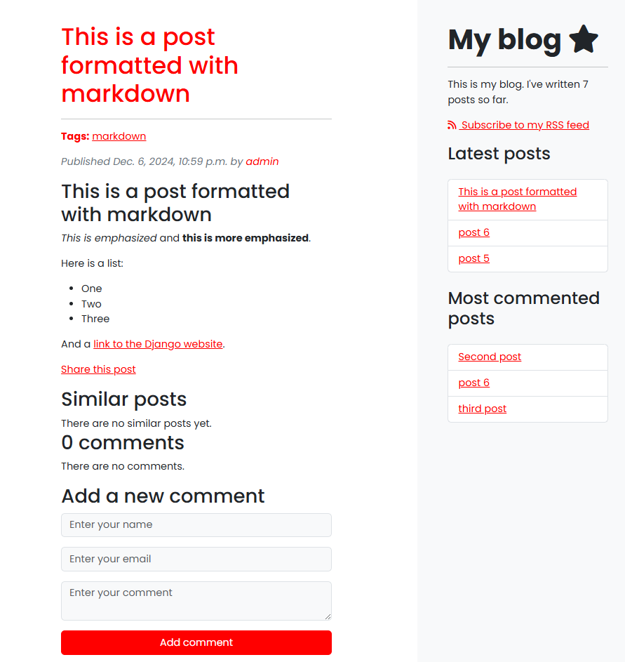

# Blog - Django Blog z Bootstrap 5, Django-Taggit, PostgreSQL i Sass

Aplikacja blogowa oparta na Django 5, Bootstrap 5, Django-Taggit, PostgreSQL i Sass. Blog oferuje nowoczesny interfejs i funkcjonalne zaplecze z możliwością personalizacji.


### Technologie
- **Django 5**: Framework webowy w Pythonie, który pozwala na szybkie budowanie solidnych aplikacji webowych.
- **Bootstrap 5**: Framework front-endowy, który umożliwia tworzenie responsywnych i mobilnych stron internetowych.
- **Django-Taggit**: Prosta biblioteka do dodawania tagów (kategorii) do postów na blogu.
- **PostgreSQL**: Potężny, otwartoźródłowy system zarządzania bazą danych.
- **Sass**: Preprocesor CSS umożliwiający pisanie czystych i łatwych do utrzymania arkuszy stylów.
### Funkcjonalności
- **Tworzenie wpisów blogowych:** Użytkownicy mogą pisać i publikować wpisy na blogu, które zawierają tytuł, treść oraz datę publikacji.
- **Komentowanie wpisów:** Czytelnicy mogą komentować posty, a komentarze są przechowywane w bazie danych i powiązane z danym postem.
- **Zoptymalizowany panel administracyjny Django:** Panel administracyjny Django został dostosowany, aby ułatwić zarządzanie postami, komentarzami, kategoriami i innymi treściami bloga.
- **Paginacja:** Blog obsługuje paginację, dzięki czemu posty są wyświetlane w sposób uporządkowany, co poprawia czytelność.
- **SEO-friendly URLs:** Każdy post na blogu ma czysty i przyjazny dla SEO URL oparty na tytule posta.
- **Powiadomienia email:** Użytkownicy mogą udostępniać posty za pomocą e-maila. Aplikacja wysyła powiadomienia e-mailowe, gdy posty są udostępniane.
- **Kategoryzacja postów:** Posty mogą być kategoryzowane za pomocą tagów Django-Taggit, co ułatwia organizowanie treści bloga.
- **Propozycje postów na podstawie tagów:** Użytkownikom wyświetlane są podobne posty na podstawie tagów przypisanych do bieżącego posta, co umożliwia odkrywanie powiązanych treści.
- **Wsparcie dla składni Markdown:** Posty mogą używać składni Markdown, co pozwala na bogate formatowanie, w tym nagłówki, linki, obrazy i listy.
- **Kanał RSS:** Aplikacja generuje kanał RSS dla nowych postów blogowych, umożliwiając subskrypcję aktualności.
- **Wyszukiwanie po tytule posta:** Użytkownicy mogą wyszukiwać posty po tytule, korzystając z podobieństwa trigramowego, co zapewnia szybkie i trafne wyniki wyszukiwania.
### Instalacja
#### Wymagania
- Python 3.8+ (najlepiej w środowisku wirtualnym)
- PostgreSQL
- Node.js (do kompilacji Sass)
#### Kroki, aby uruchomić aplikacje lokalnie
1. Sklonuj repozytorium:
```
git clone https://github.com/dmurawski/blog.git
```
2. Zainstaluj zależności Pythona:
```
pip install -r requirements.txt
```
3. Skonfiguruj bazę danych PostgreSQL:
- Utwórz bazę danych PostgreSQL i użytkownika dla aplikacji.
- Zaktualizuj ustawienia DATABASES w pliku settings.py zgodnie z danymi logowania do bazy danych.
- Skonfiguruj zmienne środowiskowe (opcjonalnie, dla ustawień e-mail):
5. Wczytanie dumpa do bazy:
```
python manage.py loaddata --exclude contenttypes mysite_data.json
```
### Struktura URL
- Strona główna: Wyświetla najnowsze posty z paginacją.
- Strona posta: Wyświetla pojedynczy post z komentarzami, tagami i powiązanymi postami.
- Strona tagu: Wyświetla listę postów powiązanych z danym tagiem.
- Strona wyników wyszukiwania: Wyświetla posty, które odpowiadają zapytaniu wyszukiwania.
- Kanał RSS: Dostępny dla postów blogowych pod adresem /feed/.
